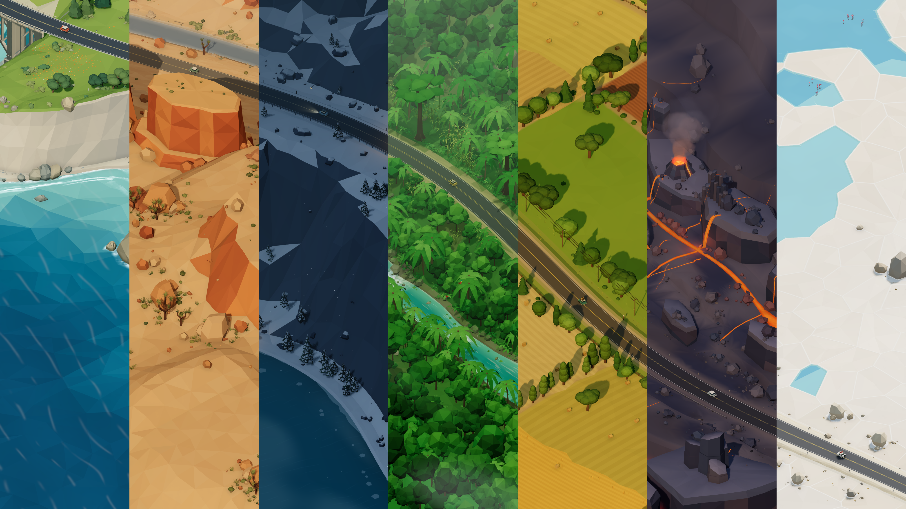

# Coastline



Endless driving game built with [Three.js](https://threejs.org/). The road, scenery and sound are all generated in code.

Play it [here](https://jarvisar.github.io/coastline/), or download the [desktop app](https://github.com/jarvisar/coastline/releases). Supports keyboard, controllers, touch screens and VR through a compatible browser. The website works offline after the first visit and can be installed from your browser.

## Routes

1. Pacific Coast
2. Red Rock Desert
3. Midnight Alpine
4. Emerald Jungle
5. Golden Plains
6. Rainy Downtown
7. Volcanic Rift

Press 1-7 or click `Change Route` to switch. Each route keeps your position and mileage until you reload, and Reset starts the current route somewhere new. Add `?seed=4817` to the URL to share or revisit a world.

Open the `Garage` to change cars or paint. `Default` uses the route's car. Cars handle differently and lose speed and grip off-road. Your car is saved, but paint resets when you reload.

For rainbow paint, enter ↑ ↑ ↓ ↓ ← → ← → B A while driving (D-pad, then B and A on a controller). Enter it again to turn it off.

## Controls

| Action | Keyboard | Controller |
| --- | --- | --- |
| Accelerate | W / ↑ | RT or A |
| Brake / reverse | S / ↓ | LT or B |
| Steer | A D / ← → | Left stick or D-pad |
| Strong brake | Space | |
| Change view | V | X |
| Autodrive | H | D-pad up |
| Pause | P / Esc | Menu |
| Garage | C / G | Left stick click |
| Next route | N | RB |
| Choose route | 1-7 | View |
| Reset | R | Y |
| Sound | M | Pause menu |
| Soft shading | O | Pause menu |
| Fullscreen | F | LB |
| FPS counter | F3 | Right stick click |

Controller buttons are Xbox names; PlayStation buttons work the same way. The numpad also works for driving. V cycles through four overhead views, third-person and first-person. Autodrive follows the road until you steer, accelerate or brake.

In menus, use the D-pad or left stick to move, A to select and B to go back. Press a button if the browser hasn't picked up your controller. Disconnecting it or leaving the tab pauses the game.

On a touch screen, tap `Let's drive` and drag the joystick in the direction you want to go. Drag farther to go faster and let go to stop. In first-person and third-person, push up to accelerate, left/right to steer and down to brake.

For VR, open the site in the Quest browser and click `Enter VR`. Use the left stick to steer, right trigger to accelerate, left trigger to brake and either grip for a strong brake. A changes the view, B pauses, X resets, Y exits VR and clicking the right stick recenters. In menus, point and pull a trigger or use the stick and A. Exiting VR pauses the game.

## Settings

The pause menu has traffic, sound, fullscreen and graphics settings. `Auto` adjusts graphics quality while you drive, or pick High, Balanced, Smooth or Basic. Soft shading adds ambient occlusion and is off by default.

Sound also starts off. Press M to turn it on. `Audio settings` has volume sliders, presets and music.

## Desktop app

Download from [Releases](https://github.com/jarvisar/coastline/releases):

- Windows: `setup.exe` or `portable.exe`
- Linux / Steam Deck: AppImage
- macOS: `.dmg` or `.zip`

The Windows installer and AppImage update automatically. See [ELECTRON.md](ELECTRON.md) for first-run steps, Steam Deck setup, launch options and building from source.

## Development

Requires [Node.js](https://nodejs.org/) 22.12+.

```sh
npm install
npm run dev       # start the dev server
npm test          # unit tests
npm run build     # build into dist/
npm run preview   # serve the build locally
```

To play on your phone, open the Network URL that Vite prints while on the same Wi-Fi. On Windows you may need to allow Node through the firewall. Testing VR on a headset needs HTTPS with a trusted certificate.

Scenery is in [src/world/](src/world/), driving is in [vehicle.js](src/vehicle.js) and scene setup is in [main.js](src/main.js). Most browser tests need the dev server running, e.g. `npm run test:browser`. The rest are listed in [package.json](package.json). They use Chrome at its default Windows path; set `CHROME_PATH` or `TEST_URL` to change that. Reports go to `.artifacts/`.

`npm run showcase:slices` regenerates the image at the top of this page. Set `SEED`, `POSITION` or `OUTPUT` to change it.

More docs:

- [Desktop app and Steam Deck](ELECTRON.md)
- [Installing the website and offline use](PWA.md)
- [Audio](docs/audio.md)
- [Discovery frequency](docs/discoveries.md)
- [Performance](docs/performance.md)

## Credits

- [three.js](https://threejs.org/) (MIT)
- [N8AO](https://github.com/N8python/n8ao) for ambient occlusion (ISC)
- [postprocessing](https://github.com/pmndrs/postprocessing) (Zlib)
